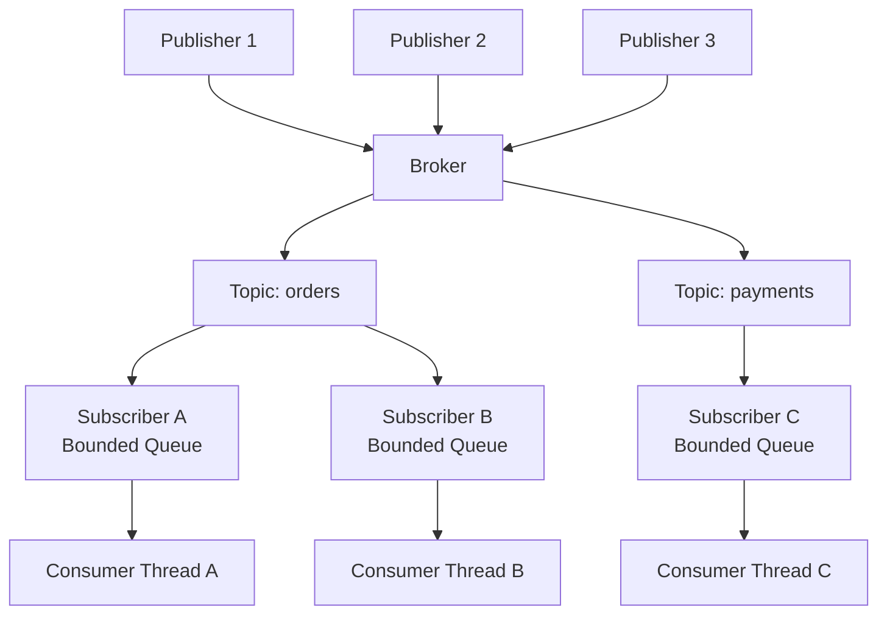
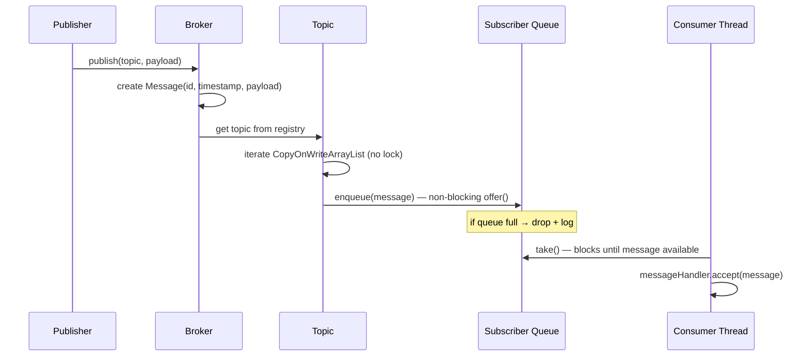
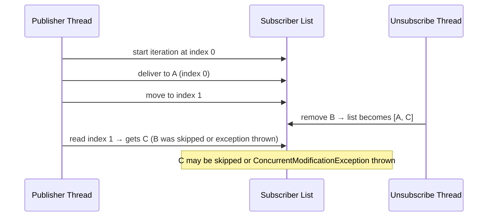
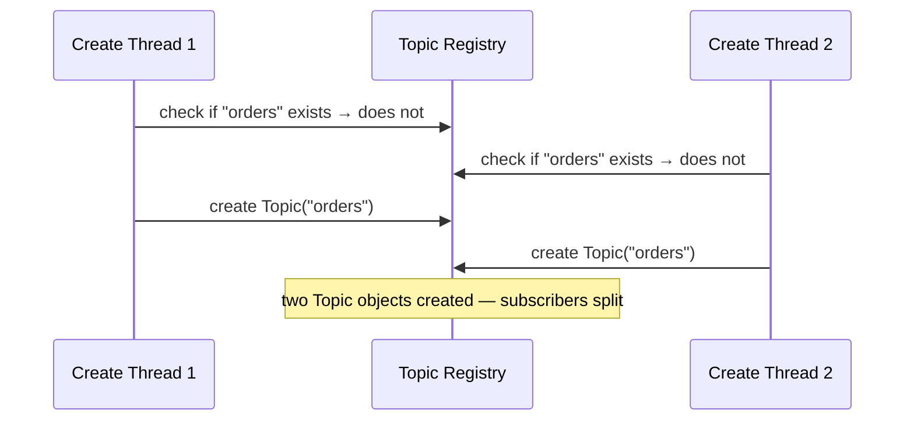
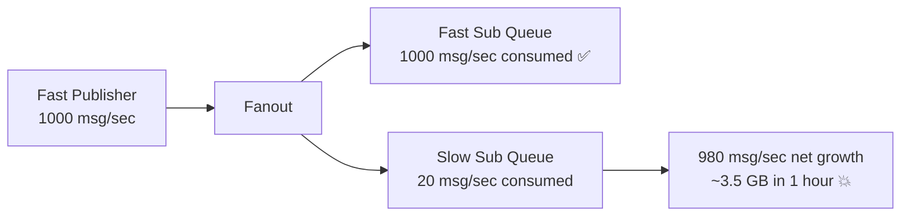
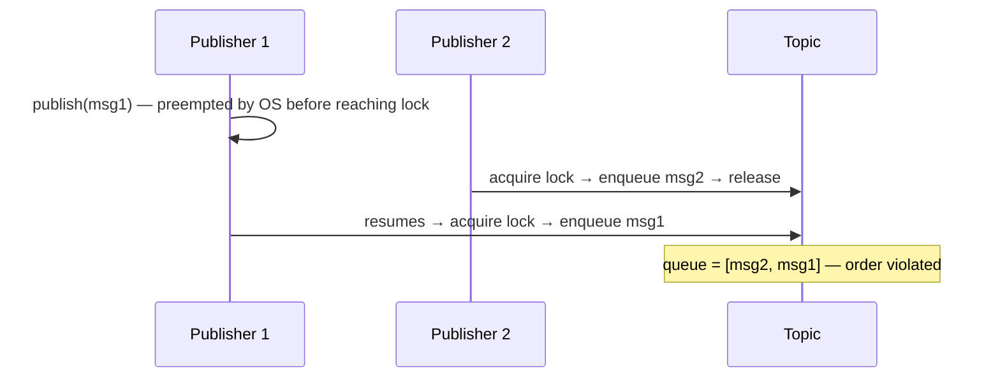
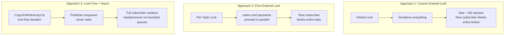
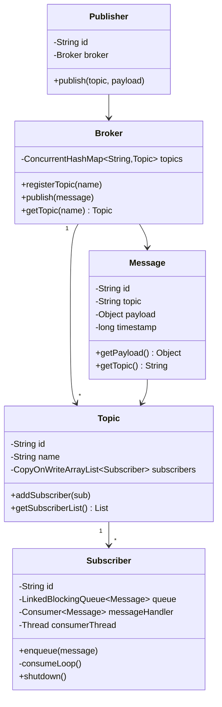

# Multithreaded Pub-Sub System

A production-grade publish-subscribe message broker implemented in Java, demonstrating core concurrency patterns including lock-free iteration, async delivery, and backpressure handling.

## Architecture



## Message Lifecycle



## Concurrency Challenges & Solutions

### C1: Subscriber List Modification During Iteration

When a publisher iterates the subscriber list to fan out a message, a concurrent unsubscribe can shift list indices — causing active subscribers to be skipped.



**Fix:** `CopyOnWriteArrayList` — mutations copy the entire array atomically. The publisher iterates a stable snapshot; unsubscribes take effect on the next publish, not mid-iteration.

---

### C2: Topic Creation Race (TOCTOU)

Two threads checking if a topic exists and creating it simultaneously can produce two separate Topic objects — splitting subscribers between them.



**Fix:** `ConcurrentHashMap.computeIfAbsent()` — collapses check + create into a single atomic operation. Only one Topic is ever created per name.

---

### C3: Slow Subscriber Backpressure

A fast publisher can overwhelm a slow subscriber. Without bounds, the queue grows until OutOfMemoryError.



**Fix:** Each subscriber gets a `LinkedBlockingQueue` with a bounded capacity. When full, `offer()` returns false and the message is dropped with a log — isolating the slow subscriber without crashing the broker or blocking other subscribers.

---

### C4: Message Ordering Violation

Two publishers publishing simultaneously have no defined order. Even with locking, a thread preempted *before* lock acquisition means the second publisher can enqueue first.



**Fix:** Single dedicated publisher thread per topic with an inbox queue. Publishers just drop into the inbox (fast, atomic). The dedicated thread drains it sequentially — whoever enqueued first is processed first.

---

## Synchronization Strategies



| Strategy | Correctness | Deadlock-free | Concurrency | Slow Subscriber Impact |
|---|---|---|---|---|
| Coarse-grained lock | ✅ | ✅ | Very low | Blocks entire broker |
| Fine-grained lock | ✅ | ✅ | Medium | Blocks entire topic |
| Lock-free + async | ✅ | ✅ | High | Isolated — drops only own messages |

## Class Design



## Key Concurrency Primitives

| Primitive | Where Used | Why |
|---|---|---|
| `ConcurrentHashMap` | Broker topic registry | Thread-safe map with atomic `computeIfAbsent` |
| `CopyOnWriteArrayList` | Topic subscriber list | Lock-free reads (publish path); safe snapshot on mutation |
| `LinkedBlockingQueue` | Per-subscriber message queue | Bounded, thread-safe, blocks consumer until message available |
| `volatile` | Subscriber `running` flag | Guarantees immediate cross-thread visibility without locking |
| `offer()` | Subscriber enqueue | Non-blocking — drops message if full instead of blocking publisher |
| `take()` | Consumer loop | Blocks thread cheaply until message available — no busy spin |

## Test Coverage

| Test | What it verifies |
|---|---|
| Basic delivery | Single subscriber receives all messages in order |
| Multiple subscribers | All subscribers on a topic receive every message |
| Slow subscriber | Fast subscriber throughput unaffected by slow one |
| Ordering violation | Two concurrent publishers produce interleaved but internally ordered output |
| Backpressure | Bounded queue drops messages when full; consumer not overwhelmed |

## Running

```bash
mvn compile exec:java -Dexec.mainClass="org.example.Main"
```

Or run `Main.java` directly from IntelliJ.